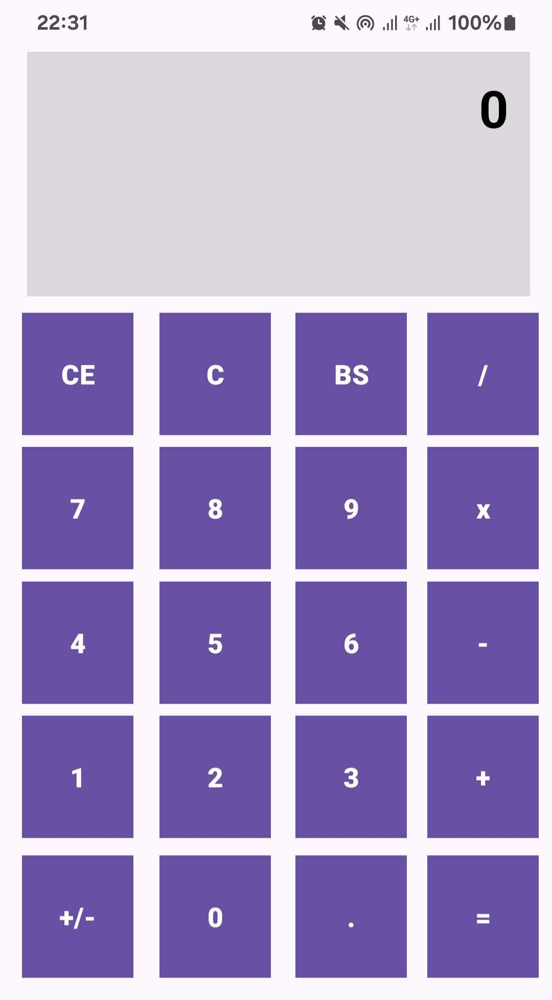

# Calculator Constraint Layout

This is a Kotlin-based application designed to create a simple calculator layout using Constraint Layout. 

## Features

- Constraint Layout only based design
- Visually organized calculator interface with:
  - Buttons for digits (0-9)
  - Buttons for basic operations (+, -, *, /)
  - Equals (=) and clear (C, CE) buttons
- Ready to be extended with actual functionality

## Screenshots

